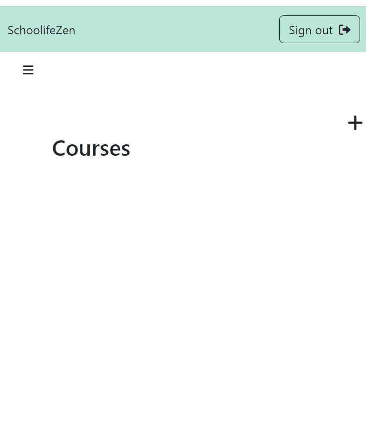

# SchoolifeZen

A Web application for students to keep track of their academic assignments.

# Why I built this application
As a college student I usually struggled to keep track of my assignments expecially when everything was switched to remote. This led me to build an application that can help keep track of upcoming assignments.

# Technologies Used
* AWS
* React.js
* HTML5
* CSS3
* Bootstrap 5
* Dokku
* Node.js
* PostgreSQL
* JSON Web Tokens
* Webpack
* Babel

# Live Link
http://schoolifezen.com/

# Features
* User can cretae a course
* User can add color to course
* User can add assignments corrsponding to the course
* User can add due dates to assignments
* User can view late assignments
* User can check out an a completed assignment
* User can delete a course
* User can create an account
* User can sign in
* User can sign out

# Demo
* User can add a course and assignment

# Stretch Features
* User can recieve reminders about upcoming assignments

 # System Requirements
* Node.js
* NPM
* PostgreSQL
* Argon2
* Express
* React
* JWT

# Getting Started
 1. Clone the repository
2. Install all dependencies using npm
3. Set up an account with AWS
4. Make a copy of the .env file and add the necessary environment variables, such as a token secret, database URL
5. Run db:import to establish database
6. Start PostgreSQL sudo service
7. Run dev to start server
8. Open in browser at localhost:3000
